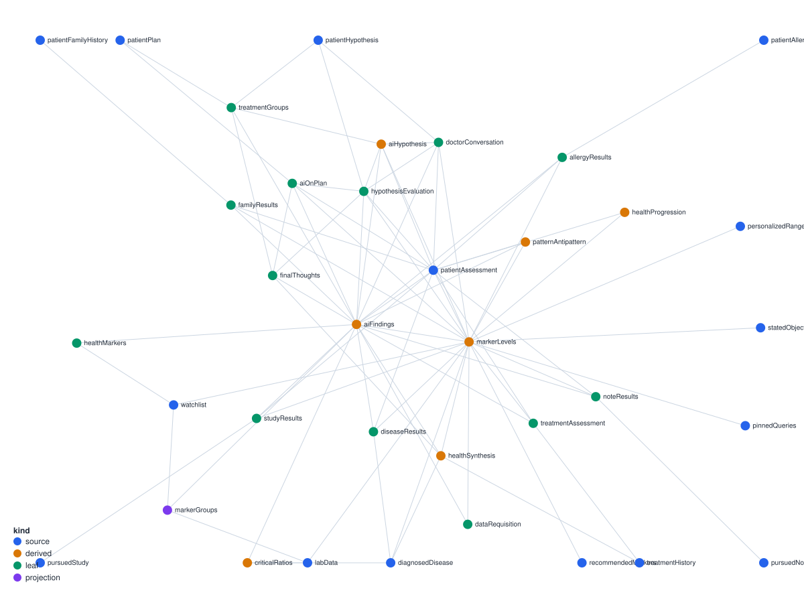

# health-reasoning

Open reasoning content behind Tiny Tars Foundation's health-literacy tools — the plain-language
explanations that turn a person's own health data into something they can read, understand, and
bring to a doctor's visit. It's structured so invited health-literacy experts can read and edit directly —
this repo carries no app code, no credentials, and no PHI, so it can be shared with anyone doing
that review.

## Map of the docs

- **[START-HERE.md](START-HERE.md)** — onboarding: editing reasoning (no code), or wiring the
  pipeline / adding a brain. Each track is ~5–10 minutes, hands-on.
- **[ARCHITECTURE.md](ARCHITECTURE.md)** — the frontmatter schema, lint rules, and sync hazards,
  specified precisely. Read this when `validate-vault.sh` fails or you need the exact contract.
- **[CONTRIBUTING.md](CONTRIBUTING.md)** — the structural-edit checklist and review process.
- **[CHANGELOG.md](CHANGELOG.md)** — version history: what changed and why.

## Layout: one folder per "brain"

A "brain" is a named dependency graph (a `Dag`, from the public `@pablotech/neuro-pil` engine):
what a piece of health reasoning is derived from, and what it feeds. `finding-dag/` is the first
one — the graph behind {{PRODUCT_NAME}}'s Finding. A second brain later is a sibling folder at the repo
root, not a restructure of this one — see [CONTRIBUTING.md](CONTRIBUTING.md#adding-a-brain).

Each brain folder is a plain-markdown [Obsidian](https://obsidian.md) vault: one note per node. The
exact frontmatter schema, section conventions, and lint rules are specified in
[ARCHITECTURE.md](ARCHITECTURE.md); the tutorial for opening one in Obsidian and reading its graph
is in [START-HERE.md](START-HERE.md).

  

*Generated by `scripts/gen-graph-view.py` (stdlib-only Python, no dependency to pin) directly from
`finding-dag/*.md` frontmatter, colored to match Obsidian's own `dag/&lt;kind&gt;` group palette — see
[START-HERE.md § Color by kind](START-HERE.md#visualizing-the-graph-in-obsidian) if you want the
same coloring live in your own Obsidian vault. Re-run the script after a structural edit changes
the graph shape; it can never drift out of sync with the vault the way a hand-taken screenshot can.

## Editing

Experts have full structural authority here — add, remove, or rewire nodes, not just edit prose on
ones that already exist. Start at [START-HERE.md](START-HERE.md) to make a first edit,
[ARCHITECTURE.md](ARCHITECTURE.md) for the exact schema and lint rules, and
[CONTRIBUTING.md](CONTRIBUTING.md) before opening a PR.

Passing `scripts/validate-vault.sh` means the graph is well-formed — it is not a substitute for
expert review of the reasoning itself (see
[ARCHITECTURE.md § What lint cannot check](ARCHITECTURE.md#what-lint-cannot-check)).

The private app that reads this graph syncs from its own checkout, not from here — see that repo's
own docs for how. `validate-vault.sh` and `gen-graph-view.py` (stdlib-only, no `package.json` here)
are the only scripts this repo ships or needs.
